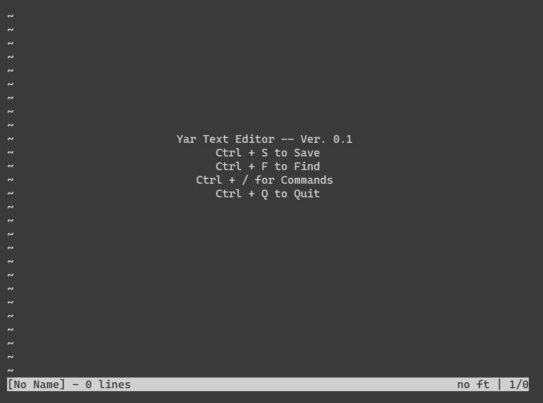

# yar

Yar is a simple terminal text editor written in C based on the [kilo tutorial](https://viewsourcecode.org/snaptoken/kilo/).

### Features
 - File opening/editing/saving
 - Syntax Highlighting
 - Text Search
 - Configurable Settings
    - Line Numbers
    - Expand Tabs
    - Tab size

### Controls
- `Ctrl + Q`: Quit. Press 2x to force quit an unsaved file.
- `Ctrl + S`: Save file
- `Ctrl + F`: Find word/phrase. Press `Esc` to cancel, and use `arrow keys` to navigate
- `Ctrl + /`: Enter commands mode

### Commands
After pressing `Ctrl + /`, the user is greeted with the `: ` bar at the bottom to enter any of the following:

 - `help`: Prints all commands
 - `tabstop`: Accepts 1 numerical argument. Sets size of tabs in spaces.
 - `expandtab`: Accepts true/false. If true, tabs are written as spaces instead of tab characters.
 - `linenumbers`: Accepts true/false. If true, line numbers are rendered on the left margin.
